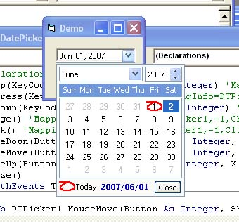



## Blue XP Style Datepicker/Dtpicker

### Description

I was looking to get xp style dtpicker for my project. I was surprised that no controls on internet could satisfy my need. My searches got me to 2 closest controls to what I want :

1. NeoCalendar, though this is a cool one (can change background etc), but it couldnt give me xp style that I want and anyway it's not free

2. OsenDtPicker, cool, almost all I want, but his dtpicker couldn't let user to write the date that they want (like true vb dtpicker could), user have to choose if they want to change the date.

So, I change OsenDTPicker to get user to be able to input the date manually (without having to choose calendar) and makes this control (which I would like to share with all of u).

Currently only blue xp style provided cause it's the only one I need as my project mainly used blue color.

Credit goes to Osen Kusnadi as I used his control (osenxpcombobox, osenxpspin, and monthpicker) as the start, and to gonchuki, as I used AButton (or chameleon button ?) for the xp style button
 
### More Info
 

             |
---                |---
**Submitted On**   |2007-05-28 09:11:12
**By**             |[Lai Min Feng](https://github.com/Planet-Source-Code/PSCIndex/blob/master/ByAuthor/lai-min-feng.md)
**Level**          |Intermediate
**User Rating**    |4.6 (46 globes from 10 users)
**Compatibility**  |VB 6\.0
**Category**       |[Custom Controls/ Forms/  Menus](https://github.com/Planet-Source-Code/PSCIndex/blob/master/ByCategory/custom-controls-forms-menus__1-4.md)
**World**          |[Visual Basic](https://github.com/Planet-Source-Code/PSCIndex/blob/master/ByWorld/visual-basic.md)
**Archive File**   |[Blue\_XP\_St206844612007\.zip](https://github.com/Planet-Source-Code/lai-min-feng-blue-xp-style-datepicker-dtpicker__1-68719/archive/master.zip)

